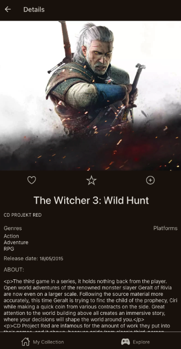

# Replayst Legacy Project

## What is replayst?

Replayst is a Full Stack Mobile application, that helps you to manage your video game collections, save your favorite games, learn more about them, and find new and interesting games to play in a list coming from the RAWG Video Games Database API.

### Tech Stack


  

The data comes from the RAWG Video Games Database API.

### Improvements

Originally, the app was written in JavaScript on the Front- and Backend. Tom and I, rewrote the app to TypeScript on both ends, added tests, rearranged the folder, and component structure, and refactored the code to use modern async/await where needed.

### Pictures

Here are some impressions of the app:




### Setup Environment Variables

Server

```bash
PORT = 3000
LOCALDB = mongodb://localhost:PORT/NAME
SALT = 10
```

Client

```bash
API_KEY=key=KEY
API_URL=https://api.rawg.io/api
```

### Starting

Server

```bash
npm run build # will build the typescript files
npm run start # to start the server
```

To get the client up and running, you can run these commands:

```bash
npm run start # will start expo
npm run android # will start android emulator
npm run ios # will start ios emulator
npm run web # will start a web emulator
```

### Contributors

This project was created by [grampassonnia](https://github.com/grampassonnia) and improved by [MrBroadie](https://github.com/MrBroadie), and [stefanfeldner](https://github.com/stefanfeldner) during the legacy project week.
