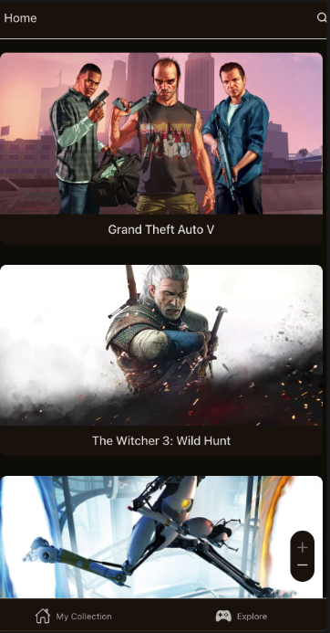

# Replayst Legacy Project

This project was created by [grampassonnia](https://github.com/grampassonnia) and improved by [MrBroadie](https://github.com/MrBroadie), and [stefanfeldner](https://github.com/stefanfeldner) during the legacy project week.

## What is replayst?

Replayst is a Full Stack Mobile application, that helps you to manage your video game collections, save your favorite games, learn more about them, and find new and interesting games to play in a list coming from the RAWG Video Games Database API.

### Tech Stack

Replayst was built with React Native and Expo using Node.js with Express.js as the backend and MongoDB as its database.

### Improvements

Originally, the app was written in JavaScript on the Front- and Backend. Tom and I, rewrote the app to TypeScript on both ends, added tests, rearranged the folder, and component structure, and refactored the code to use modern async/await where needed.

### Pictures

Here are some impressions of the app:

